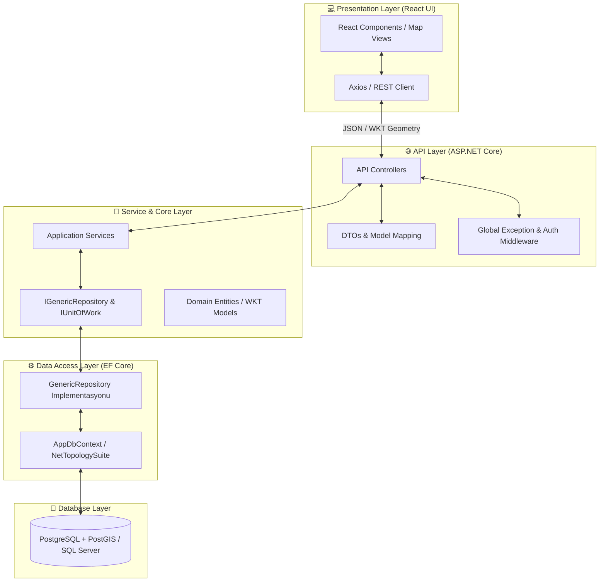
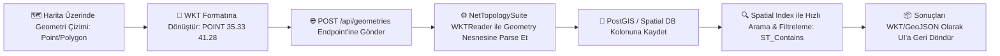
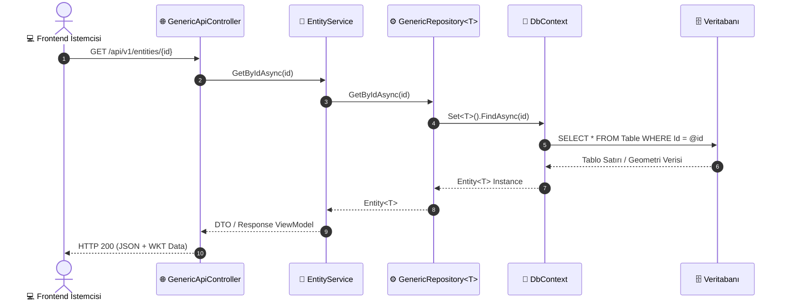

<div align="center">

# 🌍 WktExampleWithGeneric

**Generic Repository deseni ve WKT (Well-Known Text) tabanlı Coğrafi Bilgi Sistemleri (GIS) verilerini işleyen modern C# .NET & React Full-Stack mimari şablonu.**

[](https://github.com/UmutGuvenUslu/WktExampleWithGeneric/actions)
[](LICENSE)
[](https://dotnet.microsoft.com/)
[](https://react.dev/)
[](CONTRIBUTING.md)
[](https://github.com/UmutGuvenUslu/WktExampleWithGeneric/stargazers)

<p align="center">
  <a href="#-neden-wktexamplewithgeneric">Neden WktExampleWithGeneric?</a> •
  <a href="#-sistem-mimarisi-ve-katmanlar-architecture-flow">Mimari Akış</a> •
  <a href="#-wkt-mekânsal-veri-işleme-akışı-gis-spatial-flow">WKT İşleme Akışı</a> •
  <a href="#-generic-repository-ve-veri-akışı">Generic Repository Akışı</a> •
  <a href="#-temel-özellikler">Özellikler</a> •
  <a href="#-teknik-altyapı">Teknolojiler</a> •
  <a href="#-kurulum-ve-çalıştırma">Kurulum</a> •
  <a href="#-proje-dizin-yapısı">Dizin Yapısı</a>
</p>

</div>

---

## 🎯 Neden WktExampleWithGeneric?

> **Problem:** Full-stack projelerde mimari tutarlılığı sağlamak, tekrarlayan CRUD operasyonlarını yönetmek ve özellikle harita tabanlı mekânsal (WKT / Point / Polygon / LineString) geometrik verileri Entity Framework üzerinden veritabanına sorunsuz aktarmak karmaşık ve zaman alıcı bir süreçtir.

**Çözüm:** **WktExampleWithGeneric**, kurumsal C# .NET mimarisi üzerine inşa edilmiş, **Generic Repository & Unit of Work** desenlerini mekânsal WKT geometrileriyle birleştiren uçtan uca hazır bir full-stack referans projesidir.

---

## 🧠 Sistem Mimarisi ve Katmanlar (Architecture Flow)

Uygulamanın SoA (Separation of Concerns) prensiplerine göre yapılandırılmış katmanlı veri iletimi:



---

## 🗺️ WKT Mekânsal Veri İşleme Akışı (GIS Spatial Flow)

Haritadan çizilen bir geometrinin (WKT) backend'e aktarılması ve spatial sorgulanma süreci:



---

## 🔄 Generic Repository ve Veri Akışı

Generic katman üzerinden yürütülen tip güvenli veri okuma/yazma döngüsü:



---

## ✨ Temel Özellikler

* ⚡️ **Hızlı Başlangıç:** Önceden yapılandırılmış katmanlı mimari ile doğrudan iş mantığına odaklanma.
* 🧩 **Generic Repository & Unit of Work:** Kod tekrarını önleyen, tip güvenli generic CRUD mekanizması.
* 📍 **WKT & GIS Entegrasyonu:** Well-Known Text geometrik formatlarını okuma, yazma ve veritabanında saklama desteği.
* 🏗️ **Temiz & Modüler Mimari:** Core, Data, API ve UI katmanlarının birbirinden tam bağımsız ayrımı.
* 🧪 **Test Edilebilir Yapı:** Dependency Injection (DI) ve Interface tabanlı kolay unit/integration test altyapısı.
* 🔄 **Çapraz Platform:** .NET Core gücüyle Linux, macOS ve Windows üzerinde kesintisiz çalışma.

---

## 🛠️ Teknik Altyapı

| Teknoloji | Kullanım Amacı | Temel Avantaj |
| :--- | :--- | :--- |
| **C# / .NET 8** | Backend API & İş Mantığı | Güçlü tip güvenliği, yüksek asenkron performans |
| **ASP.NET Core Web API** | RESTful Uç Noktaları | Hızlı, ölçeklenebilir ve modüler routing altyapısı |
| **Entity Framework Core** | ORM & Veri Erişim | LINQ desteği, Migration yönetimi ve Spatial uzantıları |
| **NetTopologySuite** | CBS / GIS Geometri Motoru | WKT, WKB ve GeoJSON formatlarında gelişmiş mekânsal hesaplama |
| **React** | Kullanıcı Arayüzü (Frontend) | Bileşen tabanlı, modern ve dinamik harita/veri arayüzü |
| **PostgreSQL / MS SQL** | İlişkisel & Mekânsal Veritabanı | Güvenilir ve spatial indeksleme yetenekli veri depolama |

---

## 📂 Proje Dizin Yapısı

```plaintext
WktExampleWithGeneric/
├── 📁 Backend/                                  # C# .NET Çözüm ve Projeleri
│   ├── 📄 WktExampleWithGeneric.sln            # Visual Studio Çözüm Dosyası
│   ├── 📁 WktExampleWithGeneric.Api/           # API Katmanı
│   │   ├── 📁 Controllers/                     # REST Uç Noktaları
│   │   ├── 📁 Models/                          # DTO ve İstek Modelleri
│   │   ├── 📁 Services/                        # Uygulama Servisleri
│   │   ├── 📄 appsettings.json                 # Yapılandırma ve Connection Strings
│   │   └── 📄 Program.cs                       # Dependency Injection ve Middleware Girişi
│   ├── 📁 WktExampleWithGeneric.Core/          # Domain Katmanı
│   │   ├── 📁 Interfaces/                      # IGenericRepository, IUnitOfWork
│   │   └── 📁 Entities/                        # Varlıklar ve WKT Geometri Tipleri
│   └── 📁 WktExampleWithGeneric.Data/          # Veri Erişim Katmanı
│       ├── 📁 Context/                         # AppDbContext ve ModelBuilder
│       ├── 📁 Repositories/                    # GenericRepository implementasyonu
│       └── 📁 Migrations/                      # EF Core Migration Dosyaları
├── 📁 Frontend/                                 # React SPA Kaynak Kodları
│   ├── 📁 public/                              # Statik Dosyalar
│   ├── 📁 src/
│   │   ├── 📁 components/                      # Harita ve Veri Bileşenleri
│   │   ├── 📁 pages/                           # Sayfa Görünümleri
│   │   ├── 📄 App.js
│   │   └── 📄 index.js
│   ├── 📄 package.json
│   └── 📄 README.md
├── 📄 .gitignore
├── 📄 LICENSE
└── 📄 README.md
```

---

## 🚀 Kurulum ve Çalıştırma

### Gereksinimler

* **[.NET SDK 8.0+](https://dotnet.microsoft.com/download)**
* **[Node.js & npm (v18+)](https://nodejs.org/)**
* **[PostgreSQL + PostGIS](https://www.postgresql.org/)** veya **SQL Server**
* **[Git](https://git-scm.com/)**

---

### Kurulum Adımları

1. **Repoyu Klonlayın:**
   ```bash
   git clone [https://github.com/UmutGuvenUslu/WktExampleWithGeneric.git](https://github.com/UmutGuvenUslu/WktExampleWithGeneric.git)
   cd WktExampleWithGeneric
   ```

2. **Backend'i Ayağa Kaldırın:**
   ```bash
   cd Backend
   dotnet restore
   dotnet ef database update --project WktExampleWithGeneric.Data --startup-project WktExampleWithGeneric.Api
   dotnet run --project WktExampleWithGeneric.Api
   ```
   *API varsayılan olarak `https://localhost:7001` veya `http://localhost:5000` adresinde açılır.*

3. **Frontend'i Başlatın:**
   *Yeni bir terminal sekmesi açın:*
   ```bash
   cd Frontend
   npm install
   npm start
   ```
   *Arayüz `http://localhost:3000` adresinde çalışmaya başlayacaktır.*

---

## ⚙️ Ortam Yapılandırması

* **Backend:** Veritabanı bağlantı adresinizi `Backend/WktExampleWithGeneric.Api/appsettings.Development.json` dosyasından ayarlayın:
  ```json
  {
    "ConnectionStrings": {
      "DefaultConnection": "Host=localhost;Database=WktGenericDb;Username=postgres;Password=yourpassword"
    }
  }
  ```
* **Frontend:** API bağlantı URL'sini `Frontend/.env` dosyasında tanımlayabilirsiniz:
  ```env
  REACT_APP_API_BASE_URL=https://localhost:7001/api
  ```

---

## 🤝 Katkıda Bulunma

Projeye katkı sağlamak için:

1. Repoyu Fork'layın (`Fork`)
2. Yeni bir özellik dalı açın (`git checkout -b feature/YeniMekansalModul`)
3. Değişikliklerinizi commit edin (`git commit -m 'feat: Yeni WKT parse mekanizması eklendi'`)
4. Dalınıza push yapın (`git push origin feature/YeniMekansalModul`)
5. Bir **Pull Request** açın

---

<div align="center">

Geliştirici: **[Umut Güven Uslu](https://github.com/UmutGuvenUslu)**

⭐ Projeyi beğendiyseniz yıldız vermeyi unutmayın!

</div>
